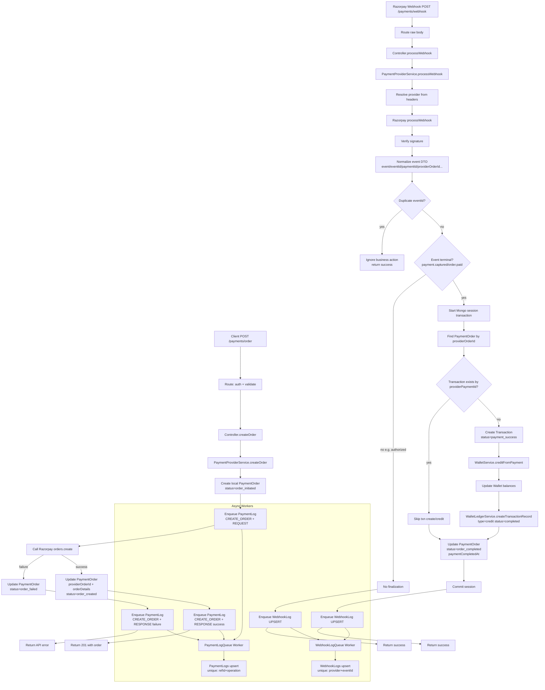

```mermaid
flowchart TD
  A[Client POST /payments/order] --> B[Route: auth + validate]
  B --> C[Controller.createOrder]
  C --> D[PaymentProviderService.createOrder]

  D --> E[Create local PaymentOrder<br/>status=order_initiated]
  E --> F[Enqueue PaymentLog<br/>CREATE_ORDER + REQUEST]
  F --> G[Call Razorpay orders.create]

  G -->|failure| H[Update PaymentOrder<br/>status=order_failed]
  H --> I[Enqueue PaymentLog<br/>CREATE_ORDER + RESPONSE failure]
  I --> J[Return API error]

  G -->|success| K[Update PaymentOrder<br/>providerOrderId + orderDetails<br/>status=order_created]
  K --> L[Enqueue PaymentLog<br/>CREATE_ORDER + RESPONSE success]
  L --> M[Return 201 with order]

  N[Razorpay Webhook POST /payments/webhook] --> O[Route raw body]
  O --> P[Controller.processWebhook]
  P --> Q[PaymentProviderService.processWebhook]
  Q --> R[Resolve provider from headers]
  R --> S[Razorpay processWebhook]
  S --> T[Verify signature]
  T --> U[Normalize event DTO<br/>event/eventId/paymentId/providerOrderId...]

  U --> V{Duplicate eventId?}
  V -->|yes| W[Ignore business action<br/>return success]
  V -->|no| X{Event terminal?<br/>payment.captured/order.paid}

  X -->|no e.g. authorized| Y[No finalization]
  Y --> Z[Enqueue WebhookLog UPSERT]
  Z --> AA[Return success]

  X -->|yes| AB[Start Mongo session transaction]
  AB --> AC[Find PaymentOrder by providerOrderId]
  AC --> AD{Transaction exists by providerPaymentId?}
  AD -->|yes| AE[Skip txn create/credit]
  AD -->|no| AF[Create Transaction<br/>status=payment_success]
  AF --> AG[WalletService.creditFromPayment]
  AG --> AH[Update Wallet balances]
  AH --> AI[WalletLedgerService.createTransactionRecord<br/>type=credit status=completed]
  AE --> AJ[Update PaymentOrder<br/>status=order_completed<br/>paymentCompletedAt]
  AI --> AJ
  AJ --> AK[Commit session]
  AK --> AL[Enqueue WebhookLog UPSERT]
  AL --> AM[Return success]

  subgraph Async Workers
    F --> W1[PaymentLogQueue Worker]
    I --> W1
    L --> W1
    Z --> W2[WebhookLogQueue Worker]
    AL --> W2
    W1 --> W3[PaymentLogs upsert<br/>unique: refId+operation]
    W2 --> W4[WebhookLogs upsert<br/>unique: provider+eventId]
  end

```