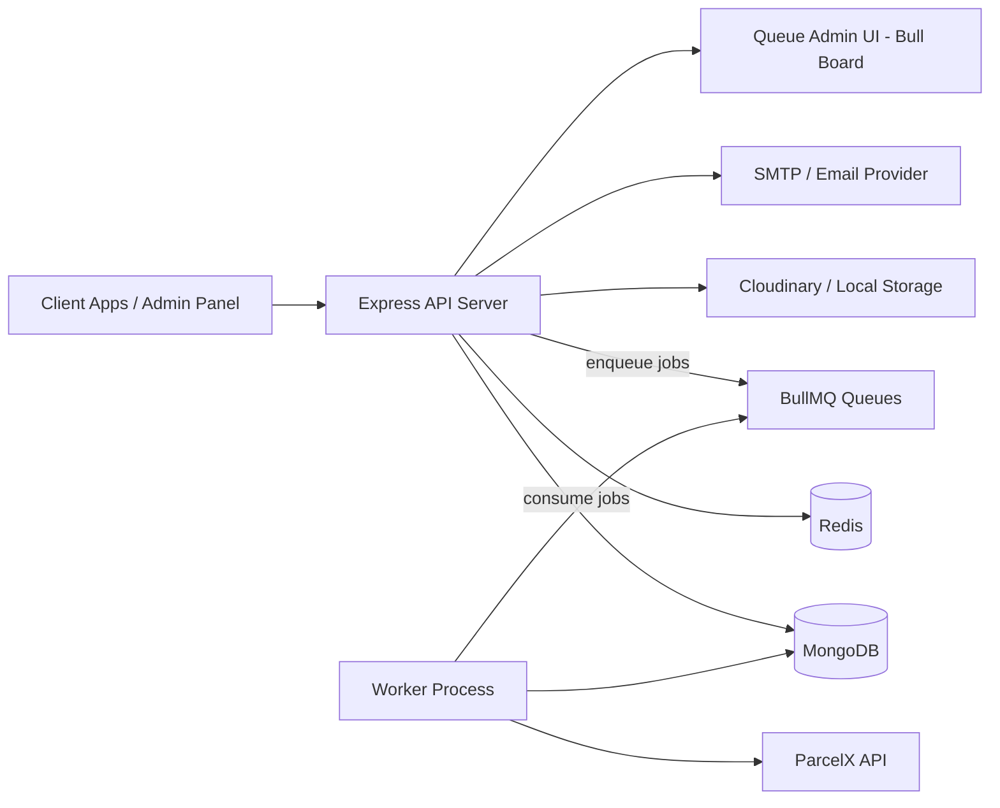
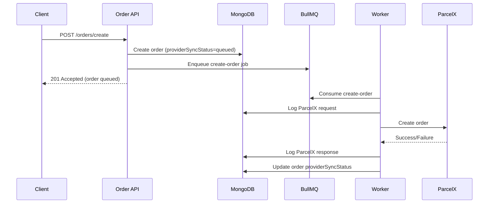
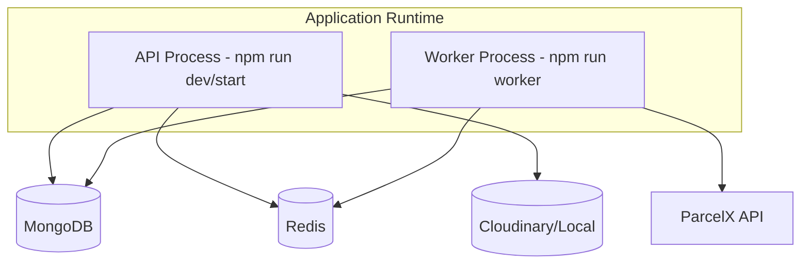

# High-Level Design (HLD) - backend_oops

## 1. Project Overview
`backend_oops` is a modular Node.js + TypeScript backend for logistics operations. It exposes REST APIs for authentication, KYC, storage, wallet, order creation/cancellation, warehouse lifecycle, queue visibility, and payment-provider integration hooks.

## 2. Architectural Style
- Monolithic service with modular boundaries (`src/modules/*`)
- Layered design inside modules: `route -> controller -> service -> repository -> schema`
- Async integration pattern for external shipping provider (ParcelX) using BullMQ workers
- Shared middleware for auth, validation, logging, and error handling

## 3. System Context

## 4. Major Building Blocks
- API Server (`server.ts`): bootstraps MongoDB, Redis ping, middleware, and route mounting.
- Domain Modules:
  - Auth: register/login/profile/password reset/logout/admin list users
  - KYC: submit/fetch/list/delete KYC records
  - Wallet: wallet CRUD + hold/ledger orchestration in service layer
  - Orders: create/cancel orders with idempotent `clientOrderId`
  - Warehouse: register/fetch/remove warehouses (with async provider sync)
  - Storage: upload/delete abstraction with pluggable provider
  - ParcelX: API client + mappers + request/response logs + queue workers
  - Payments: provider factory/service scaffold (currently partial)
- Worker Process (`src/modules/bullmq/worker.ts`): background execution for order/warehouse ParcelX jobs.

## 5. Data Stores and Responsibilities
- MongoDB:
  - Primary business entities: `User`, `Order`, `Wallet`, `WalletLedger`, `Warehouse`, `KYC`
  - Integration audit logs: `ParcelXRequestLog`, `ParcelXResponseLog`
- Redis:
  - BullMQ queue backend and worker coordination
- Object/File Storage:
  - Cloudinary (default) or local uploads

## 6. Key Runtime Flows
### 6.1 Order Create (Asynchronous Provider Sync)

### 6.2 Warehouse Register/Remove (Async)
- Register: persist warehouse, enqueue ParcelX register job, worker updates final status.
- Remove: mark `REMOVAL_PENDING`, enqueue remove job, worker finalizes inactive/rollback on failure.

## 7. Security and Validation
- JWT auth middleware with token-version invalidation support.
- Role checks via `authorize(...)` (admin endpoints protected).
- Zod request validation middleware on critical endpoints.
- Centralized error middleware for HttpError/Mongoose/JWT cases.

## 8. Deployment View

## 9. High-Level Assessment (Current State)
### Strengths
- Clear modular packaging with repository abstractions.
- Async provider integration via queue/worker improves API responsiveness.
- Idempotency support in orders (`userId + clientOrderId` unique index).
- Good observability primitives via request/response provider logs.

### Risks / Gaps
- Payment module is scaffolded but not functionally complete in controller/routes/repositories.
- ParcelX client currently returns mocked responses for core calls.
- KYC update path uses create-style logic and may cause semantic inconsistencies.
- Wallet hold/capture/release flow is partially implemented; not fully wired into order pipeline yet.
- Limited automated tests present in project scripts.

## 10. Recommended Next Architectural Steps
1. Complete payment flow end-to-end (order creation, webhook verification, transaction persistence).
2. Replace ParcelX mocks with real API calls and hardened retry/error classification.
3. Fully integrate wallet hold/capture/release lifecycle with order worker outcomes.
4. Add module-level integration tests for order + queue + provider log consistency.
5. Standardize status enums/state transitions with explicit state machine rules.
