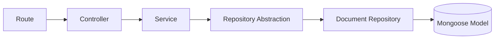
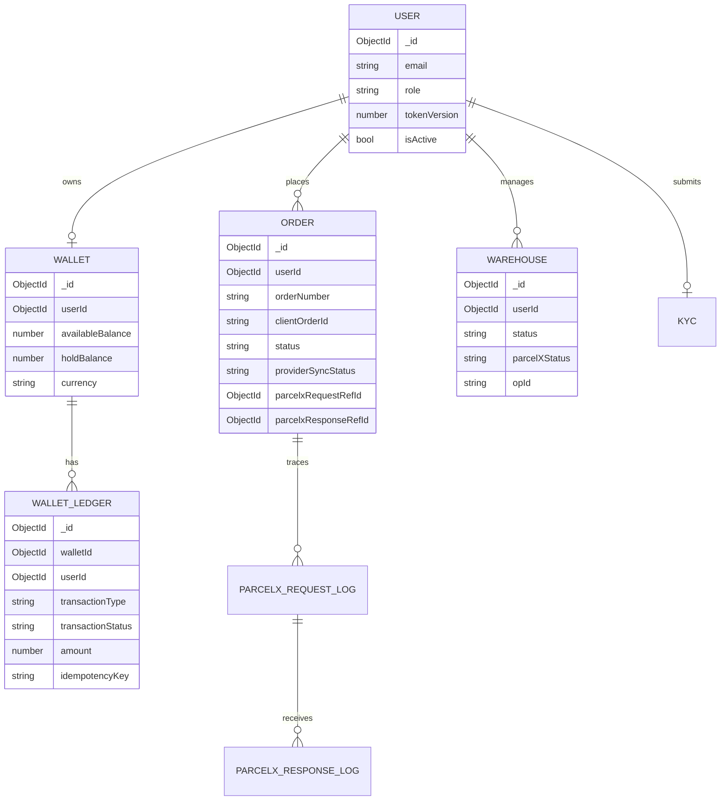
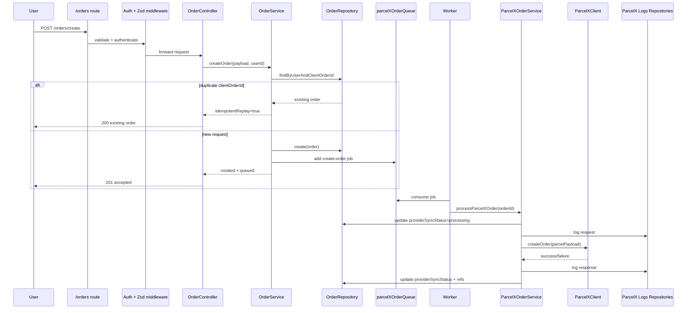
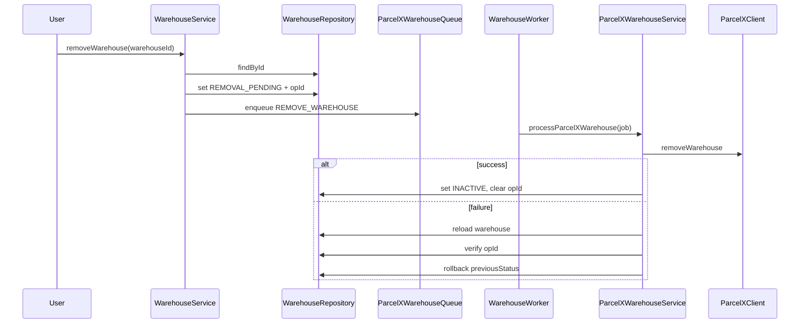

# Low-Level Design (LLD) - backend_oops

## 1. Code Organization
```text
src/
  common/            # middleware, validators, shared errors/enums/utils
  config/            # env, db, redis, cloudinary config
  modules/
    auth/
    kyc/
    orders/
    wallet/
    warehouse/
    storage/
    parcelx/
    payment-gateways/
    bullmq/
  routes/            # express route composition
server.ts            # application bootstrap
```

## 2. Layer Pattern (Per Module)


## 3. Module-Level Design

## 3.1 Auth Module
### Components
- `auth.route.ts`: endpoint wiring + zod validation + middleware guards.
- `AuthController`: request/response orchestration.
- `AuthService`: business rules (hashing, login, reset password, tokenVersion lifecycle).
- `AuthRepository` / `AuthDocumentRepository`: user persistence.
- `AuthMiddleware`: `protect`, `authorize`, `adminGuard`.

### Important Logic
- Login compares bcrypt hash, issues JWT with `tokenVersion`.
- Password change/reset/logout increments `tokenVersion` to revoke old tokens.
- Forgot password stores hashed reset token with expiry.

## 3.2 Order Module
### Components
- `OrderController`: create/cancel APIs.
- `OrderService`: idempotency check, order number generation, queue enqueue.
- `OrderRepository` / `OrderDocumentRepository`: order persistence.

### Design Notes
- On create: order is persisted first, then queue job is added.
- Unique index `{ userId, clientOrderId }` prevents duplicate client submissions.
- Provider state tracked in order via `providerSyncStatus`, `parcelxRequestRefId`, `parcelxResponseRefId`.

## 3.3 ParcelX Queue + Worker Module
### Components
- Queue factory: shared retry/backoff policy.
- Producers: order queue, order-cancel queue, warehouse queue.
- Consumers: BullMQ workers with concurrency=5.
- Services:
  - `ParcelXOrderService`: provider call + request/response logging + order status sync
  - `ParcelXWarehouseService`: register/remove flows with rollback semantics
  - `ParcelXCommonService`: normalized provider request/response log writes
- Client: `ParcelXClient` HTTP adapter (currently mocked for main endpoints).

### Worker Error Handling
- `NonRetryableJobError` -> `UnrecoverableError` (no retries)
- HTTP 401 provider auth failures -> unrecoverable
- Others follow queue retry policy

## 3.4 Warehouse Module
### Components
- `WarehouseController`, `WarehouseService`, repository abstraction + document repo.

### Logic
- Register warehouse:
  - Save warehouse
  - Map to ParcelX payload
  - Enqueue `REGISTER_WAREHOUSE`
- Remove warehouse:
  - Mark `REMOVAL_PENDING`
  - Set operation id (`opId`) for safe rollback
  - Enqueue `REMOVE_WAREHOUSE`
  - Worker sets `INACTIVE` or restores previous status on failure

## 3.5 Wallet Module
### Components
- `WalletController`: create/get/update wallet APIs.
- `WalletService`: wallet CRUD + transactional hold logic.
- `WalletLedgerService`: immutable transaction log insertion with idempotency collision handling.

### Transactional Behavior
- `createHold` starts mongoose session and updates wallet + inserts ledger atomically.
- Ledger record captures before/after available and hold balances.

## 3.6 KYC Module
### Components
- Controller/service/repository layers are present.
- APIs: register details, bank details, fetch own records, admin list/delete behavior.

### Caution
- Update/delete flow currently routes through create-oriented repository usage; refactor to explicit update semantics is recommended.

## 3.7 Storage Module
### Components
- Strategy pattern with `StorageProvider` interface.
- Providers:
  - `LocalStorageProvider`
  - `CloudinaryProvider`
- `StorageService`: input checks + provider delegation.

### Flow
- Multer memory upload -> service -> provider upload -> URL/key returned.

## 3.8 Payment Gateway Module (Partial)
### Components
- `PaymentProviderFactory` + `PaymentProviderService` abstraction.
- Razorpay provider stub exists.
- Route/controller wiring is incomplete for full order/payment lifecycle.

## 4. Core Data Model Snapshot


## 5. Detailed Sequence - Order Create Path


## 6. Detailed Sequence - Warehouse Removal with Rollback


## 7. Cross-Cutting Concerns
- Validation: Zod `validate(schema)` middleware.
- Authentication/Authorization: JWT + role guard middleware.
- Error contract: centralized `errorHandler` middleware.
- Observability:
  - request logger middleware
  - BullMQ queue UI at `/admin/queues`
  - ParcelX request/response audit collections

## 8. Technical Debt / LLD Gaps
1. Payment repositories/controllers/providers are mostly placeholders.
2. Some repository methods return `any`; stronger DTO typing is needed.
3. `KycService.updateKycDetails` semantics need true update method.
4. Wallet lifecycle methods (capture/release/refund) are not fully integrated with order worker outcomes.
5. `parcel-x-client` is still mocked for create/cancel warehouse/order core calls.

## 9. LLD Improvement Backlog
1. Introduce strict response DTOs at controller boundaries.
2. Add unit/integration tests per module with queue+DB test harness.
3. Add outbox/event pattern or dedupe strategy for enqueue reliability.
4. Refactor payment gateway module to production-ready vertical slice.
5. Add explicit state machine definitions for order/warehouse/provider sync states.
